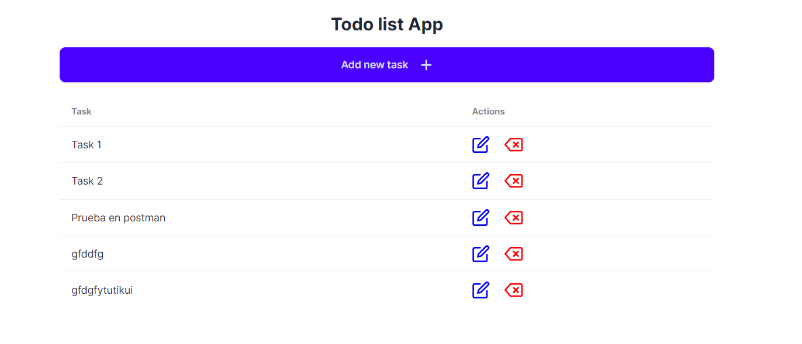
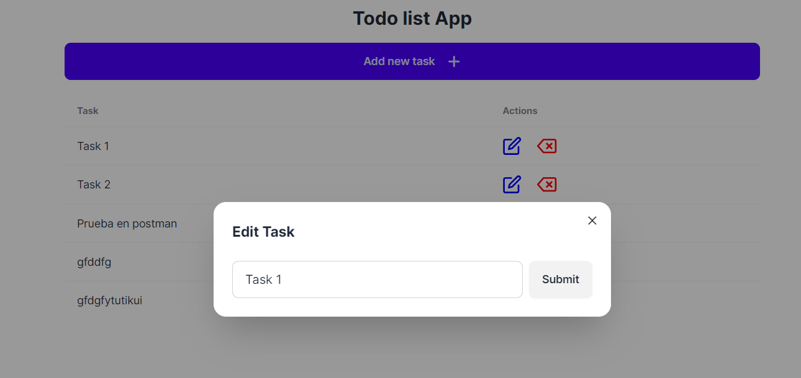
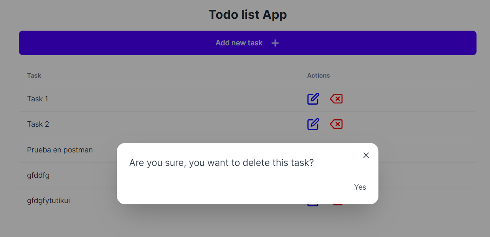

# Aplicación de Lista de Tareas

Esta es una aplicación simple de Lista de Tareas construida con React, Next.js,TypeScript, Tailwind CSS,Daisy UI y JSON Server.

El proyecto está realizado en diferentes ramas en las cuales se pueden ver el mismo proyecto realizado tanto en TypeScript como en JavaScript.

Puedes ver una imagen del resultado final a continuación:





## Tecnologías
- [Next.js](https://nextjs.org/)
- [TypeScript](https://www.typescriptlang.org/)
- [Tailwind CSS](https://tailwindcss.com/)
- [Daisy UI](https://daisyui.com/)
- [JSON Server](https://www.npmjs.com/package/json-server)
- [Axios](https://www.npmjs.com/package/axios)
- [React Icons](https://react-icons.github.io/react-icons/)
- [UUID](https://www.npmjs.com/package/uuid)

## Funcionalidades
- Crear una tarea
- Editar una tarea
- Eliminar una tarea
- Ver todas las tareas

## Inicio Rápido

1. **Clonar el repositorio:**

   ```bash
   git clone https://github.com/rcellas/todo-list-app.git
   cd todo-list-app
    ```

2. **Instalar las dependencias:**
   
    ```bash
    npm install
    ```

3. **Iniciar el servidor de desarrollo:**
    Para iniciar Next.js en modo de desarrollo, ejecuta el siguiente comando:
    ```bash
    npm run dev
    ```
    Para iniciar el servidor JSON Server, ejecuta el siguiente comando:
    ```bash
    npm run json-server
    ```

4. **Abrir la aplicación en tu navegador:**
   Podrás ver la aplicación corriendo en [http://localhost:3000](http://localhost:3000) y el servidor JSON Server en [http://localhost:3001](http://localhost:3001).

5. **Visualización del proyecto en diferentes tecnologías:**
   Para ver el proyecto realizado en JavaScript, ejecuta el siguiente comando:
   ```bash
   git checkout vanilla-todo-list
   ```
   Para ver el proyecto realizado en TypeScript, ejecuta el siguiente comando:
   ```bash
   git checkout ts-todo-list
   ```


## Licencia

Este proyecto está bajo la licencia [MIT](./LICENSE).